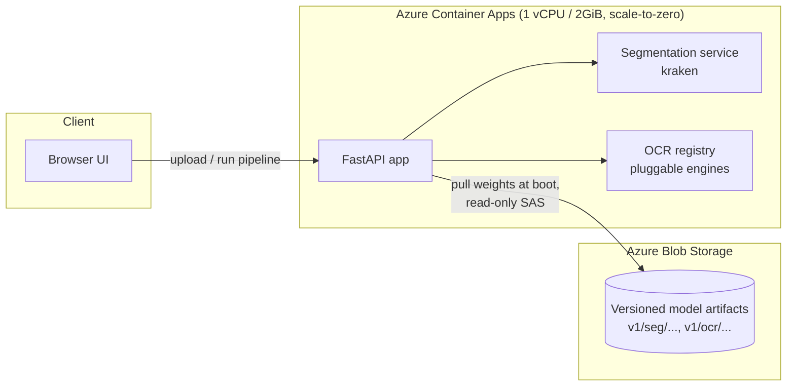

# Manuscript OCR Workbench

**[Try the live demo →](https://ocr-platform-api.purpleforest-be821c19.swedencentral.azurecontainerapps.io/)**

An end-to-end OCR pipeline for historical Arabic manuscripts: page segmentation, line-level text recognition, and export — served through a self-hosted API and deployed as a Docker container on Azure, at zero infrastructure cost.

This project pairs two things that don't usually show up together in one repo: a fine-tuned segmentation and recognition pipeline trained on manuscript data, and the production engineering to actually run it — containerized, versioned, monitored, and deployed with CI/CD.

---

## What it does

1. **Segmentation** — a fine-tuned [kraken](https://kraken.re/) model locates individual lines of text on a manuscript page image, handling the layout irregularities of handwritten historical documents.
2. **Recognition** — each segmented line is passed to an OCR engine (a custom fine-tuned recognition model, with an optional HATFormer transformer engine) to produce transcribed Arabic text.
3. **Export** — results can be exported in multiple formats for downstream use.

The frontend lets a reviewer upload a page, run the pipeline stage by stage, and inspect segmentation and recognition results directly — or try it instantly on a bundled sample page with no upload required.

## Architecture



The image ships **weights-free**. Model checkpoints live in versioned Azure Blob Storage prefixes and are pulled at container startup — this decouples code releases from model releases: retraining doesn't trigger a rebuild, and rolling back a bad model is an environment-variable change (`OCR_MODEL_VERSION=v1`), not a redeploy.

## Engineering highlights

- **Multi-stage Docker build** — CPU-only PyTorch pulled from PyTorch's dedicated index rather than the default (CUDA-bundled) PyPI wheel, keeping the image around 1GB instead of ~4GB.
- **Model artifacts versioned independently of code** — pulled from blob storage at boot with checksum verification and atomic writes, so a container killed mid-download never boots with a corrupted checkpoint.
- **Liveness vs. readiness, properly separated** — `/health` reports the process is alive; `/health/ready` reports whether each model actually loaded, and 503s until segmentation is ready. A missing checkpoint restart-loops nothing; it degrades that one engine and says so.
- **Graceful degradation by design** — each OCR engine is independently pluggable; if one fails to load, the rest of the platform still serves. `OCR_ENABLED_OCR_ENGINES` also lets a deployment deliberately drop a heavier engine (e.g. HATFormer) to fit a smaller memory budget without a different image.
- **CI/CD** — GitHub Actions lints, builds the image, boots it with no model weights present to assert it degrades correctly rather than crashing, then deploys and polls the live revision's readiness endpoint before declaring success.

## Getting started locally

```bash
docker compose up --build
```

Then open **http://localhost:8000**. The build takes 5-10 minutes the first time (downloading and compiling the ML stack); subsequent builds are cached.

Ops endpoints, useful for checking what actually loaded:

| Endpoint | Purpose |
|---|---|
| `/health` | Liveness — is the process up |
| `/health/ready` | Readiness — which models loaded, 503 until segmentation is ready |
| `/version` | Git SHA, image tag, and model version currently running |

### Model weights

The two trained model checkpoints (**segmentation model** and **OCR recognition model**) are not committed to this repository — they're binary artifacts several hundred MB in size and don't belong in git history. They're hosted privately in Azure Blob Storage and pulled automatically by the running container; for a **local** run you'll need them on disk first.

**Download them here:** `

**[OCR](https://huggingface.co/Archatext/HTR_model_Finetued_Arams-28k/blob/main/arman_run1_best.mlmodel)**
**[SEG](https://zenodo.org/records/14295555)**


`


Once downloaded, place them here and the app will pick them up on next run:

```
models/
  seg/muharaf_seg_best.mlmodel
  ocr/arman_run1_91.mlmodel      # rename the downloaded arman_run1_91.mlmodel to this
```

Full detail on the artifact-versioning design, and on how the deployed container fetches these same files automatically, is in [`docs/DEPLOYMENT.md`](docs/DEPLOYMENT.md).

## Tech stack

| Layer | Choice |
|---|---|
| API | FastAPI, Python 3.11 |
| Segmentation / OCR | kraken, PyTorch (CPU), optional HATFormer (transformers) |
| Frontend | Plain HTML/CSS/JS, no build step |
| Container | Docker, multi-stage build |
| Model storage | Azure Blob Storage, versioned prefixes |
| Compute | Azure Container Apps (scale-to-zero) |
| Registry | GitHub Container Registry |
| CI/CD | GitHub Actions |

## Where this goes next

Honestly noting what's not here yet, rather than pretending it is:

- **Automated evaluation** — a script to run a held-out set through `ketos test` and log CER/WER per model version, so choosing between `v1` and `v2` is a measurement rather than a guess.
- **Observability** — structured request logging (request ID, per-stage latency) and a `/metrics` endpoint; the orchestrators already measure inference time internally, this just needs to be exposed.
- **Test coverage** — the manifest validation, URL-building, and engine-selection logic are all cleanly unit-testable and currently aren't unit-tested.

## License

MIT
